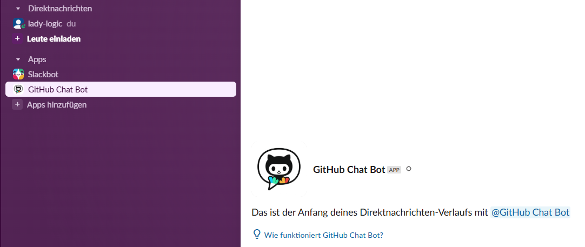

# GitHub Slack Bot

<!-- Logo -->
<p align="center">
  
</p>
AI-powered Slack bot that seamlessly integrates GitHub repositories with intelligent chat functionality

## Features

- **Smart Repository Search** - Find code across your GitHub repos instantly
- **AI-Powered Analysis** - Get intelligent insights about your development patterns  
- **Real-time Chat** - Ask questions about your codebase in natural language
- **Repository Analytics** - Analyze your programming languages and project trends

<p align="center">
  
</p>

## Demo Commands

```bash
/repos                           # List all repositories with AI analysis
/code using                      # Search for code patterns across repos
/analyze What should I learn next?  # Get AI recommendations based on your code
@GitHubBot How does authentication work in my projects?  # Free-form AI chat
```

## Tech Stack

### Backend
- **Python 3.11+** - Core application
- **FastAPI** - High-performance web framework
- **Slack Bolt SDK** - Slack integration
- **GitHub API** - Repository data access

### AI & Integration  
- **Hugging Face Transformers** - Natural language processing
- **RAG Architecture** - Context-aware AI responses
- **Webhook-based Events** - Real-time Slack communication

### DevOps & Deployment
- **ngrok** - Development tunneling
- **Docker** - Containerization ready
- **Environment Variables** - Secure configuration

## Quick Start

### 1. Clone & Setup
```bash
git clone https://github.com/your-username/github-slack-bot
cd github-slack-bot
python -m venv venv
source venv/bin/activate  # Windows: venv\Scripts\activate
pip install -r requirements.txt
```

### 2. Configuration
```bash
# Create .env file
GITHUB_TOKEN=ghp_your_token_here
GITHUB_USERNAME=your_username
SLACK_BOT_TOKEN=xoxb-your_slack_token
SLACK_SIGNING_SECRET=your_signing_secret
HUGGING_FACE_TOKEN=hf_your_token_here
```

### 3. Run Application
```bash
cd app
python main.py
```

### 4. Slack App Setup
1. Create Slack App at https://api.slack.com/apps
2. Configure Bot Permissions: `app_mentions:read`, `chat:write`, `commands`
3. Add Slash Commands: `/repos`, `/code`, `/analyze`
4. Set Event URL: `https://your-ngrok-url.ngrok-free.app/slack/events`

## Architecture

### Service-Oriented Design
```
┌─────────────────┐    ┌─────────────────┐    ┌─────────────────┐
│   Slack API     │    │   FastAPI       │    │   GitHub API    │
│                 │────│                 │────│                 │
│ User Commands   │    │ Event Handler   │    │ Repository Data │
└─────────────────┘    └─────────────────┘    └─────────────────┘
                                │
                       ┌─────────────────┐
                       │   AI Service    │
                       │                 │
                       │ Hugging Face    │
                       └─────────────────┘
```

### Key Components
- **`main.py`** - FastAPI server and routing
- **`slack_handler.py`** - Slack event processing and UI logic
- **`github_service.py`** - GitHub API integration and data management
- **`ai_service.py`** - AI processing and intelligent responses
- **`config.py`** - Environment configuration and validation

## Use Cases

### For Development Teams
- **Code Discovery** - "Find all authentication implementations"
- **Knowledge Sharing** - "How do we handle database connections?"
- **Code Review Support** - "What patterns do we use for error handling?"

### For Individual Developers  
- **Project Analysis** - "What's my most active programming language?"
- **Learning Guidance** - "What technology should I explore next?"
- **Quick Reference** - "Show me all my React projects"

## Advanced Features

### Error Handling & Resilience
- Graceful API failure handling
- Fallback responses when services are unavailable  
- Comprehensive logging and debugging

### Performance Optimizations
- Efficient GitHub API rate limit management
- Smart caching of repository data
- Timeout protection for Slack commands

## Skills Demonstrated

- **API Integration** - GitHub REST API, Slack Web API, Hugging Face Inference API
- **Event-Driven Architecture** - Webhook processing, asynchronous operations
- **AI/ML Integration** - Natural language processing, context-aware responses
- **Modern Python** - FastAPI, async/await, type hints, environment management
- **DevOps Practices** - Configuration management, containerization-ready
- **Software Architecture** - Service separation, error handling, scalable design 
